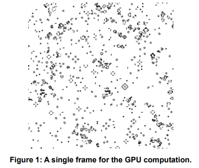
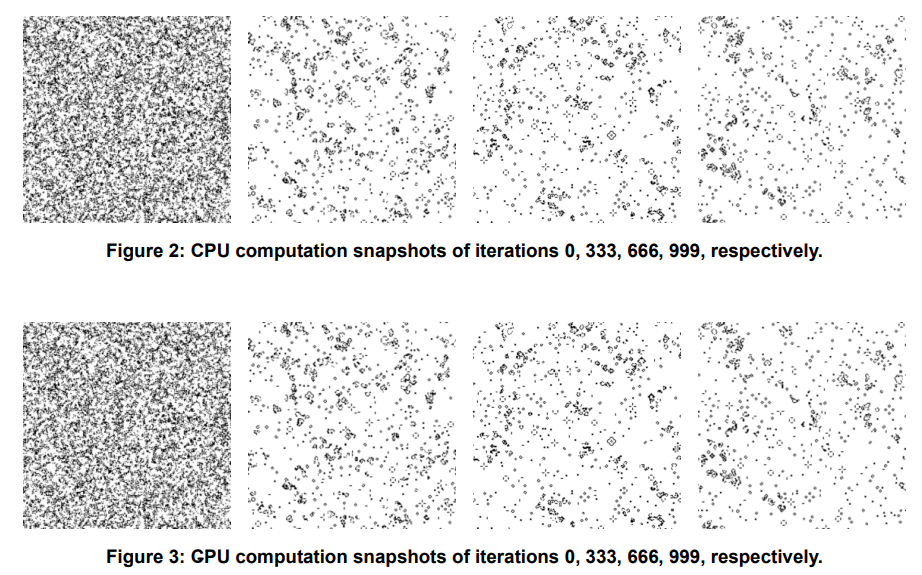
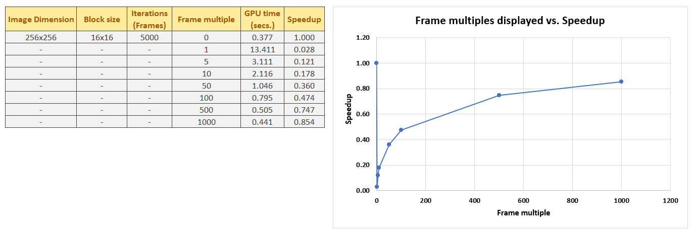

# GPU Accelerated Game of Life

## Overview
This repository hosts the codebase for implementing a global-memory GPU version of the Game of Life using CUDA.

## Requirements
- **CUDA capable computer:** Running this code requires an NVIDIA GPU and the CUDA Toolkit installed.

## Kernel function and configuration
The kernel function is responsible for updating the state of each cell in the Game of Life grid based on its neighbors. The kernel function takes in four parameters: Current population, population after applying 
Game of Life rules, image row size, and image column size. Each thread in the grid is assigned to a specific cell, and it calculates the number of alive neighbors for that cell, then applies the rules of the Game of Life to determine the next state. The kernel utilizes the image row and column sizes for boundary checking, as well as wrapping around the image data for the neighboring cells calculation.

## Verifications
Various verification methods were employed to guarantee the proper functioning of the kernel. One approach involves checking the success of CUDA API calls through error checks. Another method is by displaying frames of the population for different iterations.

Below is an image of a single frame for the GPU computation

The program additionally conducts profiling of both CPU and GPU computations to verify the accurate implementation of the original code (CPU computation) into CUDA (GPU computation). Users have the option to save 4~5 snapshots of the population frames (0th, 1/3rd, 2/3rd , and last iteration) by including the argument 'yes' in the command line. For instance, executing the command: ./CUDA_GameOfLife 256 256 1000 32 32 0 yes produces the images depicted in Figures 2 and 3.

## Visualization effect on speedup
The image below shows a table and plot of the GPU time and speedup when visualizing the population iterations.

As expected, the frequency of visualization significantly impacts the performance. Visualizing the grid at every frame (i.e. Frame multiple = 1) introduces additional overhead due to data transfer and display 
operations. As shown by the plot, reducing the visualization frequency (i.e. increasing the frame multiples) can improve overall execution time. Note that 0 was used to let the program know that no display operation is to be performed.

